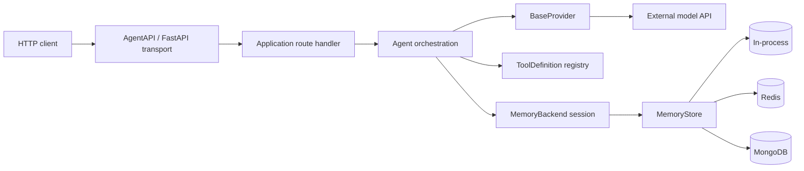

# AgentAPI architecture

This document is the entry point for contributors who need to understand how
AgentAPI is assembled, where a change belongs, and which interfaces must remain
stable. It describes the current repository implementation rather than a future
target architecture.

The detailed architecture guide lives in [`docs/architecture/`](docs/architecture/index.md):

- [System overview and package boundaries](docs/architecture/index.md)
- [Runtime and data flows](docs/architecture/runtime.md)
- [Object, class, method, and attribute reference](docs/architecture/object-model.md)
- [Feature and deployment scalability](docs/architecture/scalability.md)
- [Contributor change guide](docs/architecture/contributing.md)

## Architecture in one page

AgentAPI is a small orchestration layer around FastAPI. The framework keeps the
HTTP transport, agent loop, model-provider protocol, tools, and conversation
storage separate so each can evolve without forcing application code to change.



The primary boundaries are:

| Boundary | Contract | Responsibility |
| --- | --- | --- |
| HTTP transport | `AgentAPI(FastAPI)` | Route registration, branded OpenAPI pages, JSON/SSE response adaptation, and transport-level errors |
| Orchestration | `Agent` | Conversation assembly, provider selection, tool rounds, memory updates, and model streaming |
| Providers | `BaseProvider` | Normalize provider-specific APIs into `ProviderResponse`, `ToolCall`, and token streams |
| Tools | `@tool` and `ToolDefinition` | Turn Python callables into model-facing schemas and executable functions |
| Memory session | `MemoryBackend` / `MemorySession` | Give one agent a conversation-scoped `messages`/`add`/`reset` interface |
| Shared persistence | `MemoryStore` | Store many isolated conversation scopes in process, Redis, or MongoDB |
| Configuration | immutable `Settings` | Read and validate environment configuration when an `Agent` is constructed |

## Dependency direction

Dependencies point inward toward small protocols and normalized data objects:

```text
application code
    -> AgentAPI and Agent
        -> BaseProvider / ProviderResponse / ToolCall
        -> MemoryBackend
        -> ToolDefinition

provider implementations -> BaseProvider
memory implementations   -> MemoryStore and MemoryScope
```

Provider modules must not depend on FastAPI routes or memory implementations.
Memory stores must not know about providers or route handlers. Application-level
workflow coordination belongs outside the core package, as demonstrated by
`examples/kafka/`.

## State ownership

- `AgentAPI` owns application-wide route and SSE configuration.
- `Agent` owns a system prompt, provider configuration/cache, tool registry, and
  one `MemoryBackend` view.
- `MemorySession` owns no messages; it binds a `MemoryScope` to a shared
  `MemoryStore`.
- `MemoryStore` owns persisted conversation data and its concurrency strategy.
- Providers own API-specific configuration and response translation.
- Tool functions own their domain side effects; AgentAPI only invokes them.

This ownership model matters in servers. A single `Agent` with the default
`InMemoryMemory` represents one shared conversation. Multi-user applications
should normally keep a long-lived store and create a scoped session (and agent)
at the request or conversation boundary.

## Main extension points

- Add an LLM backend by implementing `BaseProvider`. Register it with
  `Agent.register_provider()` when it does not need to be built in.
- Add storage by implementing `MemoryStore`; consumers automatically receive a
  conforming `MemorySession` from `store.session(scope)`.
- Add model-callable behavior with decorated Python functions and `Agent.add_tool()`.
- Add HTTP behavior with ordinary FastAPI routes or `AgentAPI.chat()` /
  `AgentAPI.stream()`.
- Add cross-agent workflow orchestration outside the core package using a queue,
  event bus, or workflow engine.

Before changing one of these contracts, read the corresponding detailed guide
and the [contributor change guide](docs/architecture/contributing.md).

## Contributor reading order

1. Read the [system overview](docs/architecture/index.md) for package boundaries.
2. Follow the [runtime flows](docs/architecture/runtime.md) for the path you will change.
3. Use the [object model](docs/architecture/object-model.md) to locate concrete APIs and state.
4. Check [scalability constraints](docs/architecture/scalability.md) before adding shared state or concurrency.
5. Use the [change guide](docs/architecture/contributing.md) for implementation and verification checklists.
