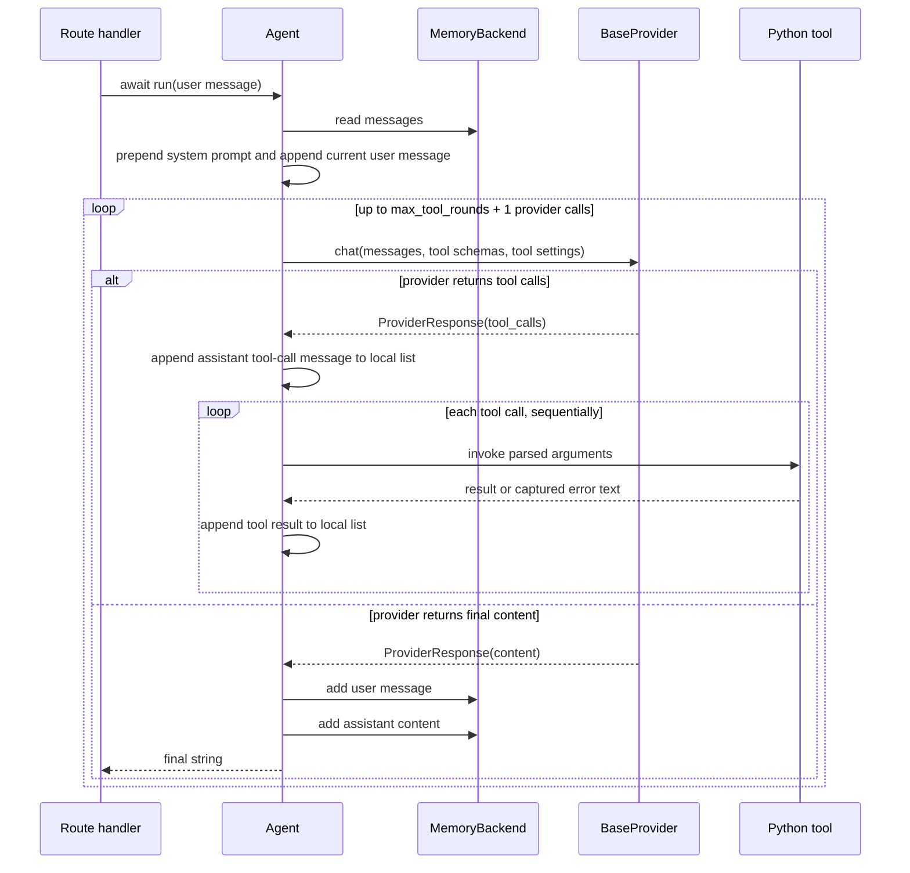
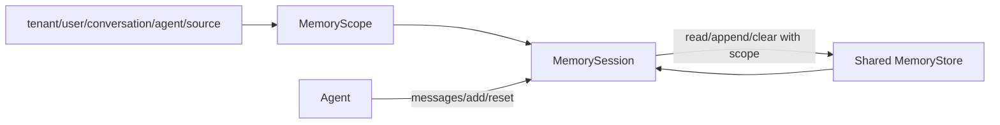

# Runtime and data flows

This page follows data through the framework. Use it before changing control
flow, error handling, message formats, streaming, or memory timing.

## Construction and lazy dependencies

Creating an `Agent` performs local setup only:

1. `get_settings()` loads the current environment into an immutable `Settings`.
2. A provider name is normalized, or a supplied `BaseProvider` instance is kept.
3. A model and provider-specific tool-calling defaults are selected.
4. A supplied `MemoryBackend` is attached; otherwise a private
   `InMemoryMemory` session is created.
5. Tool callables are converted to `ToolDefinition` objects and indexed by name.

Named providers are instantiated lazily by `_get_provider()` on the first run or
stream. The resulting provider object is cached in `Agent._provider`. Supplying a
provider instance skips named-provider construction and API-key lookup for that
provider.

## Non-stream chat and tool loop

`await Agent.run(message)` is the full orchestration path. It supports provider
tool calls and records a completed turn in memory.



The exact call path is:

1. `_conversation_messages()` creates a new list containing the system prompt,
   the backend's current messages, and the new user message.
2. `_get_provider()` returns the injected/cached provider or creates one.
3. `_tool_schemas()` returns `None` or all registered model-facing schemas.
4. `provider.chat()` returns a normalized `ProviderResponse`.
5. If tool calls exist, `_execute_tool_calls()` parses and invokes each matching
   function. Both synchronous and awaitable return values are supported.
6. Tool-call and tool-result messages are added to the local list for the next
   provider round.
7. Once content is final, only the original user message and final assistant
   content are persisted through `MemoryBackend.add()`.

Important consequences:

- Tool calls are executed sequentially even when the provider request includes
  `parallel_tool_calls=True`.
- Intermediate assistant/tool messages are not persisted by `Agent.run()`.
- Tool failures become tool-result text so the model can respond; they do not
  automatically abort the loop.
- An unknown tool name also becomes a tool-result message.
- Exhausting the loop stores and returns a fixed fallback message.

## Tool registration and execution

The `@tool` decorator does not wrap or replace the target function. It attaches:

- `__agentapi_tool_name__`
- `__agentapi_tool_description__`
- `__agentapi_tool_context__`
- `__agentapi_tool_schema__`

`Agent.add_tool()` calls `to_tool_definition()` and stores the result in a dict
keyed by tool name. Registering a second tool with the same name replaces the
first.

`_build_openai_tool_schema()` is the canonical schema generator. It maps common
Python annotations to JSON Schema types, marks every declared property as
required for strict-mode compatibility, uses nullable types for defaulted
parameters, and forbids additional properties. Provider adapters may translate
or reduce this schema; for example, Gemini removes the unsupported
`additionalProperties` key.

Tool arguments cross the provider boundary as a JSON string. `parse_tool_args()`
returns a dictionary or raises the shared `AgentProviderError` for invalid JSON.

## Streaming has two adaptation levels

AgentAPI supports two distinct streaming paths. Contributors should avoid
wrapping a stream twice.

### Agent-owned SSE

`Agent.stream(message)` returns a FastAPI `StreamingResponse`. Its internal
generator:

1. Rebuilds the conversation just like `run()`.
2. Iterates `provider.stream()` and collects emitted text.
3. Converts each token into SSE `data:` lines, preserving multi-line payloads.
4. On successful completion, stores the user message and concatenated assistant text.
5. On an orchestration provider error, logs the exception and emits a sanitized
   `[ERROR]` data event.

This path currently does not run tools and does not emit a `[DONE]` marker. When
returned from `@app.chat`, the existing `StreamingResponse` passes through as a
normal response object.

### Application-owned SSE adaptation

If an `@app.chat` handler returns an async iterator directly, `AgentAPI.chat()`
detects `__aiter__` and calls `_to_sse_response()`. `@app.stream` always requires
this iterator shape.

`_to_sse_response()`:

- splits large provider fragments using `_sse_chunk_size`;
- optionally sends `: keepalive` comments after quiet intervals;
- emits SSE error events for shared configuration/provider exceptions;
- emits `data: [DONE]` when the source completes; and
- sets no-cache, keep-alive, and nginx anti-buffering headers.

With heartbeats enabled, a producer task feeds an `asyncio.Queue`; cancellation
of the client-facing generator also cancels and awaits the producer.

## HTTP decorator flow

Both route decorators preserve the original handler metadata and signature:

1. The decorator captures `inspect.signature(func)`.
2. The generated async endpoint invokes sync or async handlers through
   `_invoke_handler()`.
3. `endpoint.__signature__` is reset so FastAPI sees the application's original
   parameters and builds the correct request/OpenAPI model.
4. The endpoint is registered with `self.post(path, **kwargs)`.
5. The decorator returns the original function, not the generated endpoint.

`chat()` maps shared `AgentConfigurationError` to HTTP 500 and shared
`AgentProviderError` to HTTP 502. `stream()` applies the same mapping before it
validates that the return value is an async iterator.

## Error boundaries

There are currently two provider-error types in the codebase:

- `agentapi.errors.AgentProviderError` is the shared provider/transport error.
- `agentapi.agent.agent.AgentAPIProviderError` is an orchestration wrapper that
  retains an `original` exception.

Providers and tool argument parsing raise the shared type. `Agent.run()` and
`Agent._stream_generator()` currently wrap unexpected provider exceptions in the
orchestration-local type. The `AgentAPI` route decorators catch the shared type,
while `Agent.stream()` catches the orchestration-local type. This is an existing
implementation seam, not a recommendation: changes to error handling must test
both non-stream HTTP responses and errors raised during streaming.

Configuration errors are intentionally distinct. Missing named-provider keys are
raised by `Agent._require_api_key()`, while invalid configured values may fail
earlier during `Settings` construction.

## Memory flow and scope resolution

The memory design separates identity, access, and storage:



`MemoryScope.__post_init__()` canonicalizes the conversation UUID and rejects
empty optional scope values. If all optional fields are absent, `scope.key` is
the raw UUID. Otherwise it is a SHA-256 hash of a stable JSON representation of
all fields. Human-readable metadata is persisted separately for administration.

`MemorySession` holds only `_store` and `scope`. Every operation delegates to the
store with that scope, which prevents a caller from accidentally reading a
different conversation through the same session object.

### Backend behavior

- `InMemoryStore` guards its dictionaries with a thread lock and returns a copy
  of the stored list. It is safe across threads in one process, not across
  worker processes.
- `RedisStore` stores messages in a Redis list and metadata in a hash. Both use
  TTLs, but clearing a conversation deletes only the messages key.
- `MongoDBStore` stores one document per `scope_key`, appends with `$push`, and
  refreshes an optional `expires_at` TTL field. It indexes scope, user, tenant,
  and expiration fields.
- The `*Memory` compatibility wrappers each create and own a private store. The
  `*Store.session()` API is the scalable path when many sessions should share
  one client or connection pool.

## Provider translation flow

All providers consume the canonical message dictionaries and OpenAI-shaped tool
schemas. They return normalized data to `Agent`:

```text
canonical messages + tool schemas
        -> provider-specific request payload
        -> remote API
        -> ProviderResponse(content, ToolCall[], raw_message)
           or AsyncIterator[str]
```

`OpenAICompatibleProvider` contains the reusable Chat Completions HTTP behavior.
OpenAI, OpenRouter, and Hugging Face only configure its URL and optional headers.
Gemini and Anthropic translate roles, tool declarations, tool results, response
blocks, and streaming formats in their own modules.

## CLI flow

The console script points to `agentapi.cli:main`.

- `agentapi new` validates project/provider input, creates a new directory, and
  writes `main.py`, `tools.py`, `agents.py`, and `.env` from module constants.
- `agentapi run` builds a `python -m uvicorn` subprocess command and returns the
  child exit code.

CLI templates are public onboarding behavior. A change to a constructor,
provider name, route decorator, or environment variable should be reflected in
the templates and tested as part of the same contribution.
